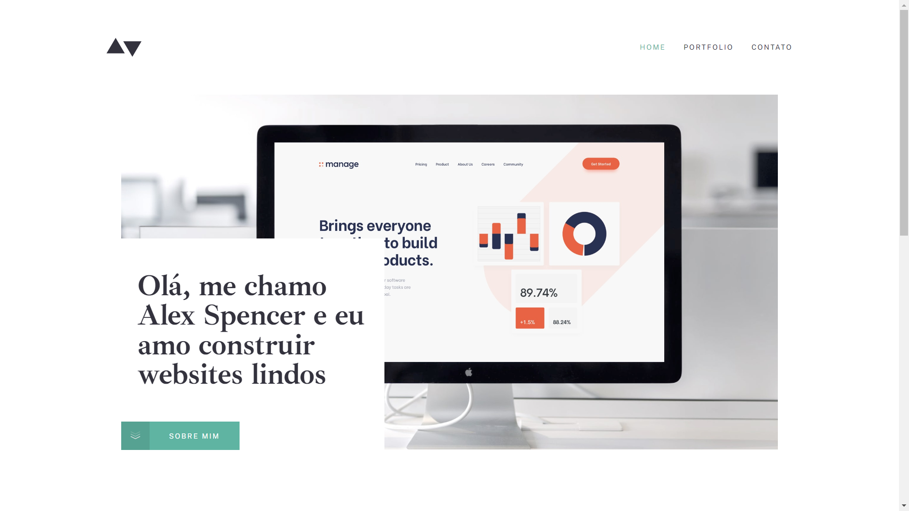
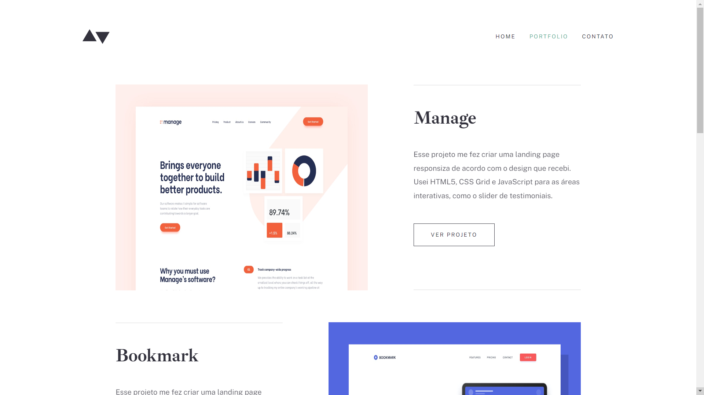
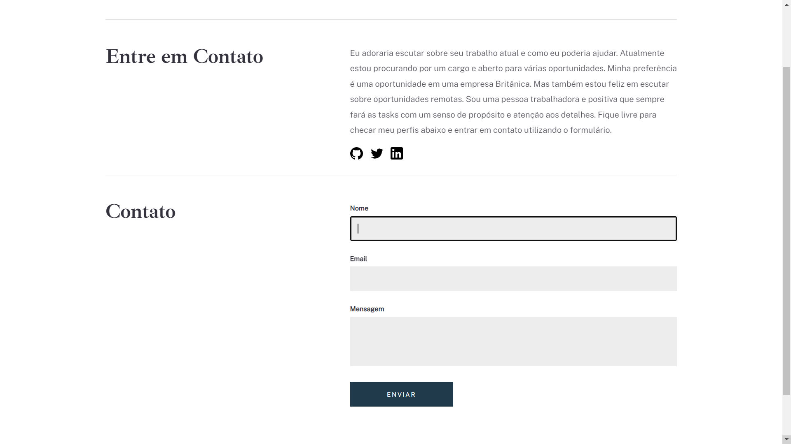

## 📌 Desafio Site Portfólio

Desafio do final do primeiro módulo do curso da <a target="_blank" href="https://cubos.academy/">**Cubos Academy**</a>. O objetivo era criar um site com base no modelo disposto no Figma, que pode ser visualizado no arquivo **'Desafio front academy 1.fig'**, utilizando apenas HTML e CSS.

O que foi realizado:
- Página home
- Página para visualização de projetos
- Página para contato

#### 👉🏼 <a target="_blank" href="https://portfolio-site-challenge.netlify.app/">**VISUALIZE O PROJETO**</a>

## 🛠 Ferramentas

## ✒️ Visual

Feito com 💜 por <a target="_blank" href="https://www.linkedin.com/in/mi-santana/">Milena Santana</a> 😊

